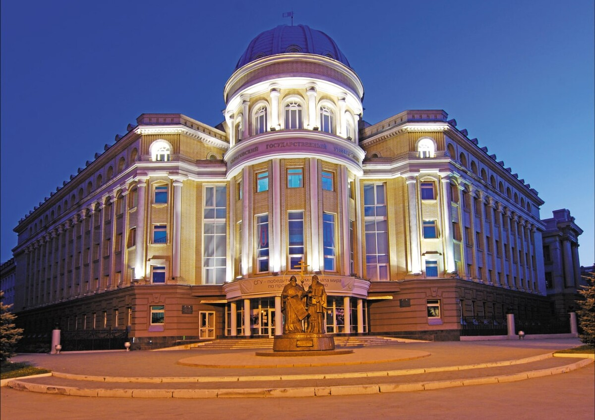
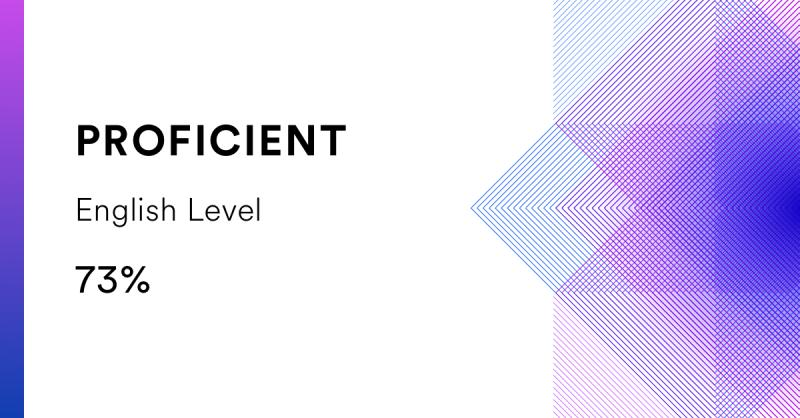

# ANASTASIA SEMYACHIKINA-GLUSHKOVSKAYA
### junior graphic and web designer
______________________

## Contact information:

_Phone: +79869997659_

_E-mail: glushkovskaya04@mail.ru_

_Telegram: https://t.me/sevayj_

[VK](https://vk.com/id224920424_)

[WhatsApp](https://wa.me/89869997659_)
_____________________

## Briefly About Myself:

While still at university, I was already interested and tried to take part in the creation of websites and pages. My keen interest in creative projects led me to seriously study HTML and CSS at university. In my free time, I took on different projects to improve my skills. 

Thanks to this practice, I mastered Photoshop, improved my skills and knowledge, and realized what I exactly wanted to do after graduating from university. I'm interested in web development because this profession provides endless opportunities for creativity and professional growth. I believe that my ability to learn and acquire new skills will help me become a proficient web developer.

______________________

## Skills and Proficiency:

> * Graphic Desigh
> * Web Desigh
> * HTML
> * CSS
> * Git, GitHub
> * English
__________________
## Code example:

Peak array index KATA from CODEWARS: Given an array of ints, return the index such that the sum of the elements to the right of that index equals the sum of the elements to the left of that index. If there is no such index, return -1. If there is more than one such index, return the left-most index.

```function peak(arr) 
{
  for (let i = 1; i < arr.length - 1; i++) {
    let leftSum = arr.slice(0, i).reduce((accumulator, currentValue) => accumulator + currentValue);
    let rightSum = arr.slice(i + 1).reduce((accumulator, currentValue) => accumulator + currentValue);
    if (leftSum === rightSum) {
      return i;
    }
  }
  return -1;
}
```
______________________

## Education:

Currently I am studying at the Chernyshevsky State University at the Faculty of Computer Science and Technology, majoring in “Mathematical support and administration of information systems.”

<p aligh = "center">
 

 ____________________

## Work experience:

No work experience

__________________
## Foreign languages:

Currently I am studying at the foreign school "Clover" at level B2. 

English – intermediate/upper intermediate (according to the online test on the EFset Logo website www.efset.org)

<p aligh = "center">
 

Russian - Native

English – intermediate level